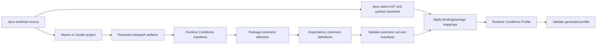

# Java Profiler Workflow

## Status

**Non-normative implementation guidance**

This guide defines the intended Java profiler workflow and package artifact conventions. It is first-party tooling guidance, not Runtime Conditions Profile spec text.

The Java profiler is a Java-native tool. The Go profiler must not parse Java source. Shared behavior across languages should come from extension definitions, binding/package manifests, profile validation, and common fixtures.

---

# 1. Design Boundary

The Java profiler starts from Java build metadata and resolved Java artifacts:



Maven and Gradle are first-class inputs. The profiler should not crawl `~/.m2`, Gradle caches, or arbitrary directories looking for manifests. It should ask the build tool for the workload's relevant project modules and classpath artifacts, then inspect only those resolved artifacts.

---

# 2. Maven Workflow

For Maven projects, the profiler should:

1. Start from a project root containing `pom.xml`.
2. Read reactor modules from the root POM.
3. Resolve the compile/runtime classpath through Maven, not by manually scanning the local repository.
4. Inspect each resolved directory or JAR for Runtime Conditions resources.
5. Treat local reactor module output directories the same as external dependency artifacts.

The expected Runtime Conditions resource layout inside a Maven artifact is:

```text
META-INF/runtimeconditions/runtimeconditions.bindings.yaml
META-INF/runtimeconditions/runtimeconditions.package.yaml
META-INF/runtimeconditions/runtimeconditions.extension.yaml
```

At source time, those files should usually live under:

```text
src/main/resources/META-INF/runtimeconditions/
```

The initial Java profiler implementation detects Maven projects and reactor modules and discovers artifacts from source/resource, build-output, explicit classpath, and JAR locations. Full Maven Resolver integration is a later implementation layer.

---

# 3. Gradle Workflow

For Gradle projects, the profiler should:

1. Start from a project root containing `settings.gradle`, `settings.gradle.kts`, `build.gradle`, or `build.gradle.kts`.
2. Read included projects from the settings file.
3. Resolve the selected source set and dependency configuration through Gradle, preferably the Gradle Tooling API.
4. Inspect each resolved directory or JAR for Runtime Conditions resources.
5. Treat local included-project output directories the same as external dependency artifacts.

The same resource layout applies:

```text
META-INF/runtimeconditions/runtimeconditions.bindings.yaml
META-INF/runtimeconditions/runtimeconditions.package.yaml
META-INF/runtimeconditions/runtimeconditions.extension.yaml
```

At source time, those files should usually live under:

```text
src/main/resources/META-INF/runtimeconditions/
```

The initial Java profiler implementation detects Gradle projects and included projects and discovers artifacts from source/resource, build-output, explicit classpath, and JAR locations. Full Gradle Tooling API integration is a later implementation layer.

---

# 4. Manifest Discovery

The Java profiler should inspect only resolved project or dependency artifacts. For each artifact, it checks:

```text
META-INF/runtimeconditions/runtimeconditions.bindings.yaml
META-INF/runtimeconditions/runtimeconditions.package.yaml
```

When either manifest exists, the profiler loads the package-local extension definition:

```text
META-INF/runtimeconditions/runtimeconditions.extension.yaml
```

During local repository development, the profiler may also accept a package-root layout:

```text
runtimeconditions.bindings.yaml
runtimeconditions.package.yaml
runtimeconditions.extension.yaml
```

That package-root layout is a development convenience. Published Maven and Gradle artifacts should use the `META-INF/runtimeconditions/` resource layout so manifests are available from the resolved classpath.

---

# 5. Java Binding Shape

Java binding manifests use `kind: RuntimeConditionsBinding` and `metadata.language: java`.

Java declaration and option entries must name the class that owns the static helper:

```yaml
java:
  package: io.runtimeconditions.extensions.commonintegrations

  constants:
    Cache.Engine.REDIS: redis

  declarations:
    - class: Cache
      function: declare
      nameArg: 0
      kind: cache
      options:
        - class: Cache
          function: keyValue
          target: interface.type
          value: key_value
          enumArg: 0
```

The initial Java validator checks the manifest against Java source conventions:

- `java.package` matches Java package declarations.
- Java declaration and option entries include `class`.
- Referenced classes exist.
- Referenced functions are public static methods.
- Referenced constants exist and have matching string values.
- `nameArg` and `stringArgs` point to `String` parameters.
- `classArg` points to `Class` parameters.

---

# 6. Source Extraction Direction

Java profile extraction should use Java-native parsing and symbol resolution. The implementation should account for:

- static imports
- overloaded methods
- enum constants
- class literals such as `Todo.class`
- generics
- nested option calls
- Maven and Gradle source sets
- multi-module builds

The first implementation slice does not parse Java source. It establishes the build-tool and artifact-discovery foundation that Java extraction will build on.

---

# 7. Current Implementation Slice

The current `java/profiler` slice implements:

- Maven, Gradle, and source-only project detection.
- Maven reactor module discovery from `<module>` entries.
- Gradle included-project discovery from `settings.gradle` or `settings.gradle.kts`.
- Runtime Conditions artifact discovery from:
  - `src/main/resources/META-INF/runtimeconditions/`
  - `target/classes/META-INF/runtimeconditions/`
  - `build/resources/main/META-INF/runtimeconditions/`
  - explicit classpath directories
  - JAR files
  - repository-local package roots
- A `discover` CLI command that prints discovered manifests.

It intentionally does not generate Runtime Conditions Profiles yet.

