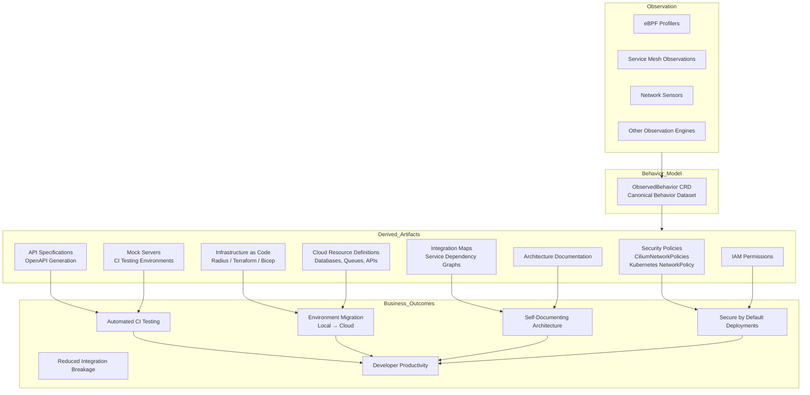
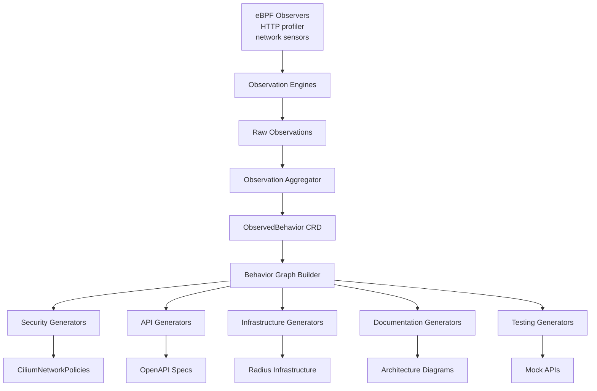

# Behavior Mental Model Map

## 1. Conceptual Model

This diagram explains the big picture: observe reality → model behavior → generate artifacts → produce business outcomes.



## 2. Causal Dependency Graph

This diagram shows the detailed causal chain from low-level signals → enriched understanding → generated outputs.

```mermaid
flowchart TB

subgraph Runtime_Signals
A1[HTTP Request\nGET /orders]
A2[TCP Connection\nPort 5432]
A3[DNS Resolution]
A4[Container Metadata]
A5[Environment Variables]
end

subgraph Raw_Observations
B1[HTTP Endpoint Observed]
B2[Service → Service Call]
B3[Service → Database Connection]
B4[External API Calls]
end

subgraph Enrichment
C1[Service Identity Resolution]
C2[Protocol Detection]
C3[Known Servers Lookup\n(Kubescape Concept)]
C4[Port-Based DB Identification]
C5[Environment Metadata]
end

subgraph Canonical_Model
D1[ObservedBehavior CRD]
end

subgraph Derived_Graph
E1[Service Dependency Graph]
E2[API Endpoint Map]
E3[Infrastructure Dependency Graph]
E4[External Integration Graph]
end

subgraph Artifact_Generators
F1[Network Policy Generator]
F2[OpenAPI Spec Generator]
F3[Mock Server Generator]
F4[IaC Generator]
F5[Cloud Migration Generator]
F6[Architecture Diagram Generator]
F7[IAM Policy Generator]
end

subgraph Generated_Artifacts
G1[CiliumNetworkPolicies]
G2[OpenAPI Specs]
G3[Mock APIs]
G4[Radius / Terraform Infrastructure]
G5[Cloud Service Definitions]
G6[Architecture Docs]
G7[Least Privilege IAM]
end

Runtime_Signals --> Raw_Observations
Raw_Observations --> Enrichment
Enrichment --> D1

D1 --> Derived_Graph

Derived_Graph --> Artifact_Generators

F1 --> G1
F2 --> G2
F3 --> G3
F4 --> G4
F5 --> G5
F6 --> G6
F7 --> G7
```

## 3. Relationship to Kubescape Concepts

Kubescape provides a specific implementation of part of this model, particularly the security branch.

```mermaid
Relationship to Kubescape Concepts

Kubescape provides a specific implementation of part of this model, particularly the security branch.

flowchart LR

A[Observed Network Traffic]
B[Network Neighborhood CRD\nKubescape]
C[Known Servers CRD\nKubescape]
D[Enriched Network Model]
E[Network Policies]

A --> B
C --> D
B --> D
D --> E
```

In the broader system architecture proposed here:

```text
Kubescape NetworkNeighborhood
            ↓
      ObservedBehavior
            ↓
     Multi-Domain Outputs
```

Kubescape contributes network-level behavior capture, but the larger Application Modeling Engine expands this to include:

- API modeling
- Infrastructure generation
- CI testing automation
- Architecture documentation
- Cloud resource provisioning

## 4. High-Level System Architecture



