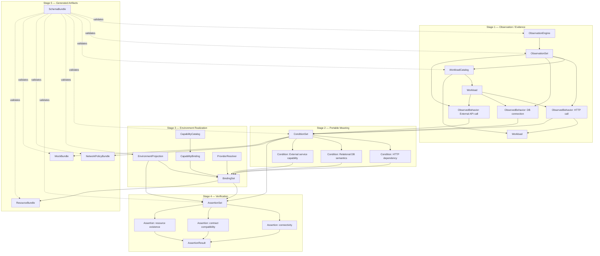
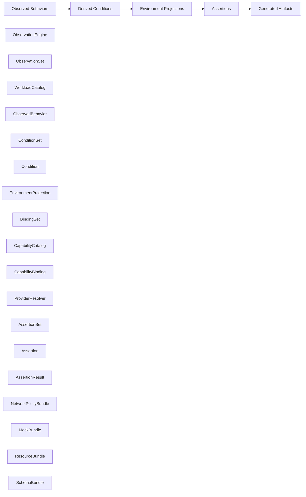
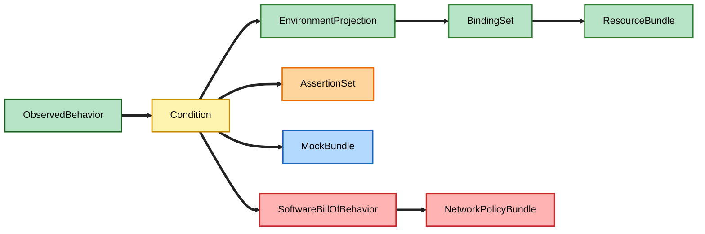

# Internal Graph Data Model

This diagram treats the system as a graph-centered pipeline:

**ObservationEngine / ObservationSet / WorkloadCatalog / ObservedBehavior**
→ **ConditionSet / Condition**
→ **EnvironmentProjection / BindingSet / CapabilityCatalog / CapabilityBinding**
→ **AssertionSet / Assertion / AssertionResult**
→ **NetworkPolicyBundle / MockBundle / ResourceBundle**

This follows the lifecycle defined in the object catalog:
**Observed Behaviors → Derived Conditions → Environment Projections → Assertions → Generated Artifacts**.

---

## 1. Internal Graph Data Model

---

## 2. What each stage means

### Stage 1 — Observation / Evidence

- **ObservationEngine** describes the observer producing the signal.
- **ObservationSet** groups captured data from a run.
- **WorkloadCatalog** normalizes runtime identities.
- **ObservedBehavior** is the atomic runtime interaction record.

### Stage 2 — Portable Meaning

- **ConditionSet** groups derived runtime requirements.
- **Condition** expresses a single requirement (e.g., relational DB, HTTP API).

### Stage 3 — Environment Realization

- **EnvironmentProjection** defines the target platform.
- **BindingSet** wires conditions to concrete implementations.
- **CapabilityCatalog** defines reusable platform capabilities.
- **CapabilityBinding** maps requirements to capabilities.
- **ProviderResolver** enriches bindings with provider-specific semantics.

### Stage 4 — Verification

- **AssertionSet** groups validation checks.
- **Assertion** expresses a specific rule.
- **AssertionResult** records validation outcomes.

### Stage 5 — Generated Artifacts

- **NetworkPolicyBundle** for Kubernetes/Cilium policies.
- **MockBundle** for generated mocks and CI testing.
- **ResourceBundle** for Terraform/Radius/Crossplane artifacts.
- **SchemaBundle** validates the entire ecosystem.

---

## 3. Artifact placement in the mental model

---

## 4. Recommended node and edge types

### Node types

ObservationEngine  
ObservationSet  
Workload  
ObservedBehavior  
Condition  
EnvironmentProjection  
Binding  
Capability  
Assertion  
Artifact  
Provider  
Schema  

### Edge types

PRODUCED_BY  
RECORDED_IN  
IDENTIFIED_AS  
OBSERVED_FROM  
OBSERVED_TO  
DERIVES  
PROJECTED_INTO  
BOUND_TO  
SATISFIED_BY  
VERIFIED_BY  
RESULTED_IN  
GENERATED_AS  
VALIDATED_BY  
ENRICHED_BY  

---

## 5. Example graph paths

### Security path

ObservedBehavior(service-a → service-b HTTP)  
→ Condition(service-a requires access)  
→ EnvironmentProjection(prod-cluster)  
→ BindingSet(resolve workload)  
→ Assertion(connectivity valid)  
→ NetworkPolicyBundle

### API mock generation path

ObservedBehavior(service-a → orders-api GET /orders)  
→ Condition(HTTP contract dependency)  
→ Assertion(contract reachable)  
→ MockBundle(mock server)

### Environment migration path

ObservedBehavior(app → mysql endpoint port 3306)  
→ Condition(relational DB semantics)  
→ EnvironmentProjection(aws-prod)  
→ BindingSet(bind AWS RDS)  
→ ProviderResolver(enrich provider semantics)  
→ ResourceBundle(terraform/radius)

### Platform capability abstraction path

ObservedBehavior(app → email API)  
→ Condition(email capability)  
→ CapabilityBinding(email-service abstraction)  
→ BindingSet(dev=SendGrid, prod=SES)  
→ Assertion(validate provider availability)  
→ ResourceBundle

---

## 6. Architectural insight

ObservedBehavior = evidence  
Condition = portable meaning  
Binding = environment-specific realization  
Assertion = proof of runtime success  
Bundle = emitted artifact

---

## 7. Framing sentence

The system turns runtime evidence into a portable application dependency graph, then projects that graph into environment-specific bindings, validations, and generated artifacts.

---

## 8. Compact slide diagram

