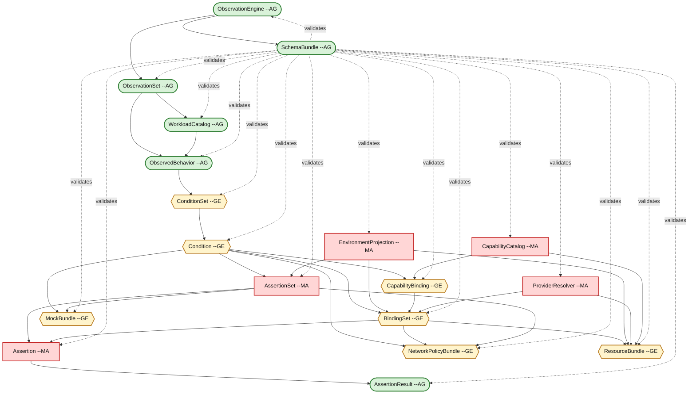
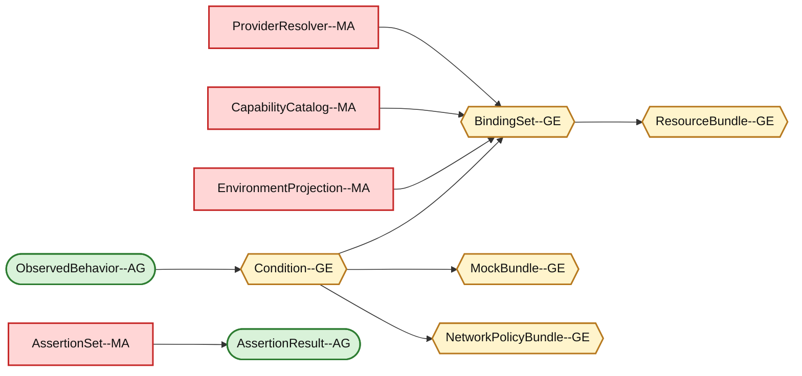

# Resource Dependency DAG

This diagram shows the dependency relationships among the internal data resources in the observation-driven application modeling system.

It also indicates how each resource is expected to be created and maintained:

- **AG** = fully auto-generated
- **GE** = generated, then edited/refined by humans
- **MA** = manually authored

## Legend

- **Rounded green nodes** = AG
- **Hexagon yellow nodes** = GE
- **Rectangle red nodes** = MA

---

## 1. Resource Dependency DAG



---

## 2. Reading the DAG

The graph is easiest to understand in five layers.

### Observation layer

These resources are derived directly from runtime capture and engine metadata.

- `ObservationEngine` → describes the observer and its capabilities
- `ObservationSet` → groups one capture run
- `WorkloadCatalog` → normalizes workload identities
- `ObservedBehavior` → records runtime evidence

These are primarily **auto-generated** because they represent discovered facts.

---

### Meaning layer

This is where raw evidence becomes portable runtime meaning.

- `ConditionSet`
- `Condition`

These are **generated first**, but often need refinement to express:

- capability semantics
- contract expectations
- performance requirements
- compatibility constraints

That is why they are marked **GE**.

---

### Intent / projection layer

This is the human-authored control plane for the system.

- `EnvironmentProjection`
- `CapabilityCatalog`
- `ProviderResolver`
- `AssertionSet`
- `Assertion`

These are marked **MA** because they encode intent that cannot be inferred reliably from observation alone, such as:

- target cloud
- desired managed services
- compliance constraints
- organizational standards
- provider mapping knowledge

---

### Binding / realization layer

These resources connect portable requirements to concrete implementations.

- `CapabilityBinding`
- `BindingSet`

These are **generated, then edited** because the system can suggest mappings, but humans often need to refine them based on:

- cost
- reliability
- provider preference
- operational standards

---

### Output / verification layer

These represent either evaluated results or generated artifacts.

- `AssertionResult` = **AG**
- `NetworkPolicyBundle` = **GE**
- `MockBundle` = **GE**
- `ResourceBundle` = **GE**
- `SchemaBundle` = **AG**

These are either computed automatically or generated with optional refinement.

---

## 3. Key dependency paths

### Security policy path

```text
ObservedBehavior
  → ConditionSet
  → Condition
  → BindingSet
  → AssertionSet / Assertion
  → NetworkPolicyBundle
```

This is the path used for things like:

- Kubernetes NetworkPolicy
- CiliumNetworkPolicy
- Kubescape-style policy generation

---

### Mock generation path

```text
ObservedBehavior
  → ConditionSet
  → Condition
  → AssertionSet
  → MockBundle
```

This is useful for:

- mock servers
- CI contract testing
- integration isolation

---

### Infrastructure generation path

```text
ObservedBehavior
  → ConditionSet
  → Condition
  → CapabilityBinding
  → BindingSet
  → ResourceBundle
```

This is the path used for:

- Radius
- Terraform
- Crossplane
- cloud resource provisioning

---

### Validation path

```text
Condition
  + EnvironmentProjection
  + BindingSet
  + AssertionSet
  → Assertion
  → AssertionResult
```

This is the path that proves whether the projected environment actually satisfies the observed application requirements.

---

## 4. Simplified controller/operator view

One of the reasons this DAG is useful is that it hints at the controllers your platform will need.

### Likely controllers

- **Observation ingestion controller**
  - produces `ObservationSet`, `WorkloadCatalog`, `ObservedBehavior`

- **Condition derivation controller**
  - produces `ConditionSet`, `Condition`

- **Binding/projection controller**
  - consumes `Condition`, `EnvironmentProjection`, `CapabilityCatalog`, `ProviderResolver`
  - produces `CapabilityBinding`, `BindingSet`

- **Assertion controller**
  - consumes `Condition`, `BindingSet`, `AssertionSet`
  - produces `Assertion`, `AssertionResult`

- **Artifact generation controller**
  - produces `NetworkPolicyBundle`, `MockBundle`, `ResourceBundle`

- **Schema/codegen controller**
  - produces `SchemaBundle`

---

## 5. Resource classification summary

| Resource | Classification | Why |
|---|---|---|
| ObservationEngine | AG | Mostly introspected or self-declared |
| ObservationSet | AG | Produced from observation runs |
| WorkloadCatalog | AG | Runtime identity normalization |
| ObservedBehavior | AG | Ground truth evidence |
| ConditionSet | GE | Derived automatically, then refined |
| Condition | GE | Derived requirement, often edited |
| EnvironmentProjection | MA | Human target-environment intent |
| CapabilityCatalog | MA | Human-defined platform abstractions |
| ProviderResolver | MA | Human-defined provider mapping logic |
| CapabilityBinding | GE | Suggested mapping, often refined |
| BindingSet | GE | Concrete realization, often refined |
| AssertionSet | MA | Human-defined policy templates |
| Assertion | MA | Human-defined checks or standards |
| AssertionResult | AG | Computed validation output |
| NetworkPolicyBundle | GE | Generated baseline, often tuned |
| MockBundle | GE | Generated mocks, often customized |
| ResourceBundle | GE | Generated IaC, often customized |
| SchemaBundle | AG | Generated from schema sources |

---

## 6. Core design insight

The DAG reveals a clean separation of responsibility:

```text
Auto-generated resources = evidence and computed results
Generated+edited resources = inferred meaning and deployable artifacts
Manual resources = human intent and organizational standards
```

Or more compactly:

```text
Facts → Meaning → Intent → Realization → Validation → Artifacts
```

Where:

- **Facts** come from observation
- **Meaning** is inferred from facts
- **Intent** is supplied by humans
- **Realization** binds meaning to intent
- **Validation** proves correctness
- **Artifacts** are emitted for downstream use

---

## 7. Compact slide version

